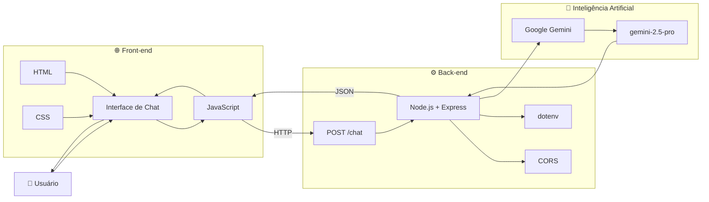
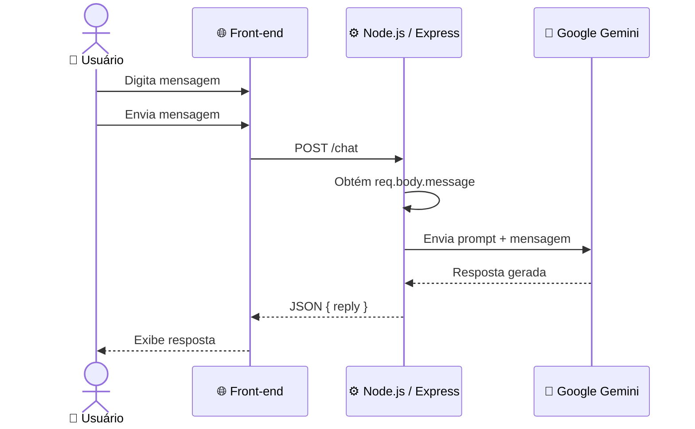
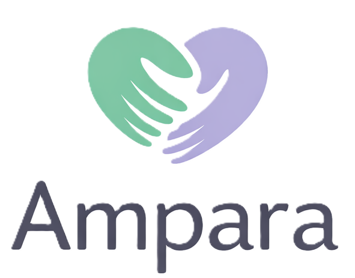

<div align="center">

# 💚 AMPARA

### Tecnologia que acolhe. Informação que orienta.

**Plataforma web de apoio emocional com Inteligência Artificial**

<br>


<br><br>

<a href="https://github.com/MiqueiasNves/ampara-1">
  
</a>

</div>

---

## 🧭 Índice

* [Sobre o projeto](#-sobre-o-projeto)
* [Problema](#-problema)
* [Objetivo](#-objetivo)
* [Funcionalidades](#-funcionalidades)
* [Caso de uso](#-caso-de-uso)
* [Arquitetura](#-arquitetura)
* [Fluxo da aplicação](#-fluxo-da-aplicação)
* [Tecnologias](#-tecnologias)
* [Estrutura do projeto](#-estrutura-do-projeto)
* [Instalação](#-instalação)
* [Configuração da API](#-configuração-da-api)
* [Screenshots](#-screenshots)
* [Segurança e responsabilidade](#-segurança-e-responsabilidade)
* [Próximos passos](#-próximos-passos)
* [Contribuição](#-contribuição)
* [Desenvolvimento](#-desenvolvimento)

---

# 💚 Sobre o projeto

O **Ampara** é uma plataforma web criada para oferecer um espaço digital de **informação, acolhimento e apoio emocional**.

A aplicação reúne conteúdos educativos relacionados à saúde mental e uma interface de conversa com a **Ampara IA**, permitindo que o usuário envie mensagens e receba respostas geradas por Inteligência Artificial.

O projeto combina uma interface desenvolvida com tecnologias web tradicionais com um servidor **Node.js + Express**, responsável pela comunicação com a API do **Google Gemini**.

> **A proposta do Ampara não é substituir profissionais de saúde, mas utilizar a tecnologia como uma ferramenta de informação e acolhimento inicial.**

---

# 🎯 Problema

Questões relacionadas à saúde mental fazem parte da vida de muitas pessoas, mas nem sempre existe facilidade para encontrar informações confiáveis, compreender determinados temas ou simplesmente encontrar um espaço inicial de conversa.

O Ampara busca utilizar a tecnologia para criar uma experiência digital simples, acessível e acolhedora, reunindo **conteúdo educativo + interação com Inteligência Artificial** em uma única plataforma.

---

# 🚀 Objetivo

O projeto tem como principais objetivos:

* 💚 Criar um ambiente digital acolhedor;
* 🧠 Disponibilizar conteúdos relacionados à saúde mental;
* 🤖 Utilizar Inteligência Artificial para conversas empáticas;
* 🌱 Incentivar autocuidado e reflexão;
* 🤝 Facilitar o acesso a informações e recursos de apoio;
* 💻 Aplicar conhecimentos de desenvolvimento web e integração com APIs de IA.

---

# ✨ Funcionalidades

## 🤖 Conversar com a Ampara

A plataforma possui uma área específica para conversar com a Ampara IA.

A interface apresenta:

* Avatar da Ampara;
* Status de disponibilidade;
* Histórico visual das mensagens;
* Campo para digitação;
* Botão de envio;
* Aviso de que a IA não substitui acompanhamento profissional.

A página `converse-com-ampara.html` implementa essa interface e utiliza o `chatbot.js` para realizar a comunicação com o back-end.

---

## 🧠 Conteúdos de saúde mental

O projeto possui páginas específicas para diferentes temas:

| Página                       | Tema                  |
| ---------------------------- | --------------------- |
| `saude-mental.html`          | 🧠 Saúde Mental       |
| `ansiedade.html`             | 😰 Ansiedade          |
| `depressao.html`             | 💭 Depressão          |
| `burnout.html`               | 🔥 Burnout            |
| `estresse.html`              | ⚡ Estresse            |
| `autoestima.html`            | ❤️ Autoestima         |
| `sono.html`                  | 😴 Sono               |
| `reeduque-sua-mente.html`    | 🌱 Reeduque sua mente |
| `voce-nao-esta-sozinho.html` | 🤝 Apoio              |

Essas páginas estão presentes no diretório `frontend/pages` do projeto original.

---

# 🧩 Caso de uso

## UC-01 — Conversar com a Ampara

### 👤 Ator

**Usuário**

### 🎯 Objetivo

Permitir que o usuário envie uma mensagem para a Ampara e receba uma resposta gerada por Inteligência Artificial.

### Pré-condições

* A aplicação deve estar em execução;
* O servidor deve possuir uma chave válida da API Gemini;
* O usuário deve acessar a página de conversa.

### Fluxo principal

```text
1. Usuário acessa a plataforma
        ↓
2. Usuário seleciona "Converse com a Ampara"
        ↓
3. Sistema apresenta a interface de conversa
        ↓
4. Usuário digita uma mensagem
        ↓
5. Usuário envia a mensagem
        ↓
6. Front-end envia POST /chat
        ↓
7. Back-end recebe a mensagem
        ↓
8. Sistema cria o prompt da Ampara
        ↓
9. Prompt é enviado ao Google Gemini
        ↓
10. Gemini gera a resposta
        ↓
11. Back-end retorna JSON
        ↓
12. Front-end apresenta a resposta
```

O servidor implementa a rota `POST /chat`, recebe `req.body.message`, gera o prompt e chama `model.generateContent()`.

---

## 🔀 Fluxo alternativo — erro na IA

```text
Usuário envia mensagem
        ↓
Servidor tenta consultar Gemini
        ↓
Ocorre erro
        ↓
Servidor registra o erro
        ↓
HTTP 500
        ↓
Usuário recebe mensagem de erro
```

O código atual retorna uma mensagem informando que ocorreu um erro ao conversar com a Ampara quando a geração falha.

---

# 🏗️ Arquitetura

O Ampara utiliza uma arquitetura simples dividida em duas camadas principais:

```text
┌──────────────────────────────────────────────┐
│                    USUÁRIO                   │
└──────────────────────┬───────────────────────┘
                       │
                       ▼
┌──────────────────────────────────────────────┐
│                 FRONT-END                    │
│                                              │
│  HTML  ──  CSS  ──  JavaScript               │
│                                              │
│  • Interface                                 │
│  • Navegação                                 │
│  • Conteúdos                                 │
│  • Chat                                      │
└──────────────────────┬───────────────────────┘
                       │
                       │ HTTP POST /chat
                       ▼
┌──────────────────────────────────────────────┐
│                  BACK-END                    │
│                                              │
│              Node.js + Express               │
│                                              │
│  • API                                       │
│  • CORS                                      │
│  • Variáveis de ambiente                     │
│  • Integração com Gemini                     │
└──────────────────────┬───────────────────────┘
                       │
                       │ API
                       ▼
┌──────────────────────────────────────────────┐
│             GOOGLE GEMINI API                │
│                                              │
│              gemini-2.5-pro                  │
└──────────────────────┬───────────────────────┘
                       │
                       │ Resposta
                       ▼
                 AMPARA IA 💚
```

O Express também serve os arquivos estáticos localizados no diretório `frontend`, enquanto a API é responsável pelo endpoint de conversa.

---

# 📐 Diagrama de componentes



---

# 🔄 Fluxo de comunicação



---

# 🛠️ Tecnologias

## Front-end

<div align="center">


<br><br>


</div>

### HTML

Estrutura das páginas e componentes da aplicação.

### CSS

Responsável pela identidade visual, layout, responsividade e estilização.

### JavaScript

Responsável pela interatividade da aplicação e comunicação do chatbot com o servidor.

O projeto possui `chatbot.js` e `script.js` no diretório `frontend/js`.

---

# ⚙️ Back-end

<div align="center">


<br><br>


</div>

O `package.json` atual declara:

* `express`
* `cors`
* `dotenv`
* `@google/generative-ai`

e utiliza CommonJS.

---

# 🤖 Inteligência Artificial

A integração de IA utiliza:

**Google Generative AI**

Modelo configurado:

```text
gemini-2.5-pro
```

A chave da API é carregada através da variável de ambiente:

```env
GEMINI_API_KEY=sua_chave_aqui
```

O back-end utiliza `GoogleGenerativeAI` para inicializar o serviço e `generateContent()` para gerar as respostas.

---

# 📁 Estrutura do projeto

A estrutura atual do projeto original está organizada desta forma:

```text
ampara/
│
├── backend/
│   ├── package.json
│   ├── package-lock.json
│   └── server.js
│
├── frontend/
│   │
│   ├── assets/
│   │   └── images/
│   │       ├── logo.png
│   │       ├── logo2.png
│   │       └── logo3.png
│   │
│   ├── css/
│   │   ├── style.css
│   │   └── chat.css
│   │
│   ├── js/
│   │   ├── chatbot.js
│   │   └── script.js
│   │
│   ├── pages/
│   │   ├── ansiedade.html
│   │   ├── autoestima.html
│   │   ├── burnout.html
│   │   ├── converse-com-ampara.html
│   │   ├── depressao.html
│   │   ├── estresse.html
│   │   ├── reeduque-sua-mente.html
│   │   ├── saude-mental.html
│   │   ├── sono.html
│   │   └── voce-nao-esta-sozinho.html
│   │
│   └── index.html
│
├── .gitignore
└── README.md
```

---

# 🚀 Instalação

## 1. Clonar o repositório

```bash
git clone https://github.com/MiqueiasNves/ampara-1.git
```

Depois:

```bash
cd ampara-1
```

---

## 2. Entrar no back-end

```bash
cd backend
```

---

## 3. Instalar dependências

```bash
npm install
```

---

# 🔐 Configuração da API Gemini

Na pasta `backend`, crie um arquivo:

```text
.env
```

Adicione:

```env
GEMINI_API_KEY=sua_chave_da_api
PORT=3000
```

### ⚠️ Importante

**Nunca envie sua chave da API para o GitHub.**

O arquivo `.env` deve permanecer protegido pelo `.gitignore`.

---

# ▶️ Executando o projeto

Dentro da pasta `backend`:

```bash
node server.js
```

Caso tudo esteja funcionando, o servidor será iniciado na porta configurada ou na porta padrão `3000`.

Acesse:

```text
http://localhost:3000
```

O servidor possui uma rota inicial utilizada para verificar seu funcionamento:

```text
Servidor da Ampara funcionando 💚
```

---

# 📸 Screenshots

O projeto já possui uma identidade visual própria e três arquivos de logo em:

```text
frontend/assets/images/
```

incluindo `logo.png`, `logo2.png` e `logo3.png`.

Para apresentar o projeto no GitHub, recomendo adicionar capturas reais da aplicação nesta seção.

### 🏠 Página inicial

<p align="center">
  
</p>

### 🤖 Interface de conversa

A página de conversa utiliza a identidade visual da Ampara e apresenta:

* avatar;
* status online;
* mensagens;
* campo de entrada;
* botão de envio;
* aviso sobre acompanhamento profissional.

Esses elementos estão presentes diretamente em `converse-com-ampara.html`.

> **Sugestão:** depois de executar o projeto localmente, tire screenshots da página inicial e do chat e salve-as em `frontend/assets/screenshots/`. Isso deixará o README muito mais forte visualmente.

---

# 🛡️ Segurança e responsabilidade

O Ampara foi projetado com uma premissa importante:

> **A Inteligência Artificial não substitui acompanhamento psicológico ou médico profissional.**

O prompt configurado no servidor orienta a IA a:

* acolher emocionalmente;
* conversar com empatia;
* incentivar autocuidado;
* evitar julgamentos;
* manter uma comunicação gentil;
* manter uma comunicação calma;
* não substituir psicólogos;
* recomendar ajuda profissional em casos graves.

Essas regras estão implementadas diretamente no `server.js`.

### ⚠️ Importante

O Ampara deve ser entendido como uma **ferramenta de informação e acolhimento inicial**, e não como ferramenta de diagnóstico ou tratamento.

Em situações de emergência ou risco, o usuário deve procurar atendimento profissional e os serviços de emergência disponíveis em sua região.

---

# 🔮 Próximos passos

## 🤖 Inteligência Artificial

* [ ] Melhorar o contexto das conversas;
* [ ] Implementar histórico de conversa;
* [ ] Melhorar tratamento de situações de risco;
* [ ] Aprimorar o prompt;
* [ ] Implementar controle de sessão;
* [ ] Adicionar mecanismos de segurança específicos para conteúdo sensível.

## ⚙️ Back-end

* [ ] Criar documentação da API;
* [ ] Implementar validação das entradas;
* [ ] Adicionar testes automatizados;
* [ ] Implementar tratamento de erros mais estruturado;
* [ ] Adicionar logging;
* [ ] Implementar rate limiting.

## 🎨 Front-end

* [ ] Melhorar responsividade;
* [ ] Melhorar acessibilidade;
* [ ] Aprimorar experiência do chat;
* [ ] Criar microinterações;
* [ ] Melhorar navegação entre conteúdos.

## 🚀 Infraestrutura

* [ ] Deploy do back-end;
* [ ] Deploy do front-end;
* [ ] Configuração de variáveis de ambiente em produção;
* [ ] CI/CD;
* [ ] Monitoramento da aplicação.

---

# 🤝 Contribuição

Contribuições são bem-vindas.

### 1. Faça um fork

Utilize o botão **Fork** no GitHub.

### 2. Clone seu fork

```bash
git clone https://github.com/SEU-USUARIO/ampara-1.git
```

### 3. Crie uma branch

```bash
git checkout -b feature/minha-funcionalidade
```

### 4. Desenvolva

Faça suas alterações e teste localmente.

### 5. Commit

```bash
git add .
git commit -m "feat: adiciona nova funcionalidade"
```

### 6. Push

```bash
git push origin feature/minha-funcionalidade
```

### 7. Pull Request

Abra um Pull Request explicando:

* o que foi desenvolvido;
* qual problema foi resolvido;
* como testar;
* quais arquivos foram alterados.

---

# 📚 O que este projeto demonstra

O Ampara reúne diferentes conceitos importantes de desenvolvimento:

```text
┌────────────────────────────────────────────┐
│              CONHECIMENTOS                 │
├────────────────────────────────────────────┤
│                                            │
│  ✓ HTML                                    │
│  ✓ CSS                                     │
│  ✓ JavaScript                              │
│  ✓ Node.js                                 │
│  ✓ Express                                 │
│  ✓ APIs HTTP                               │
│  ✓ Integração com Inteligência Artificial  │
│  ✓ Variáveis de ambiente                   │
│  ✓ Git / GitHub                            │
│  ✓ Organização de projeto                  │
│  ✓ UX / UI                                 │
│                                            │
└────────────────────────────────────────────┘
```

---

# 👨‍💻 Desenvolvimento

O projeto presente neste repositório é uma versão derivada do projeto **Ampara**, originalmente disponibilizado pelos alunos [`anecouto/ampara`](https://github.com/anecouto/ampara) ,
[`MiqueiasNves`](https://github.com/MiqueiasNves) e [`DenisioMotta`](https://github.com/denisiomotta21-create). 

A estrutura original conta com 20 commits, um diretório de front-end e outro de back-end, além de recursos visuais próprios.

Este repositório pode ser utilizado como espaço para **estudo, evolução e implementação de novas funcionalidades** sobre a base do projeto.

---

# 💚 Propósito

> **Tecnologia pode ser mais humana.**

O Ampara representa a união entre **tecnologia, Inteligência Artificial, experiência do usuário e propósito social**.

Mais do que desenvolver uma aplicação web, o projeto busca explorar como ferramentas digitais podem criar experiências mais acessíveis, acolhedoras e centradas nas pessoas.

---

<div align="center">

## 💚 AMPARA

### Acolher. Informar. Conectar.

<br>


<br><br>

**Desenvolvido com tecnologia e propósito.**

</div>
