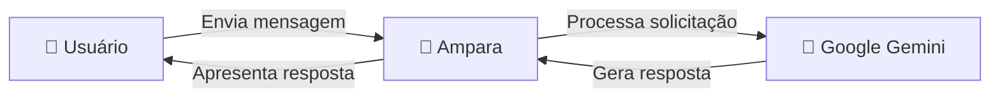
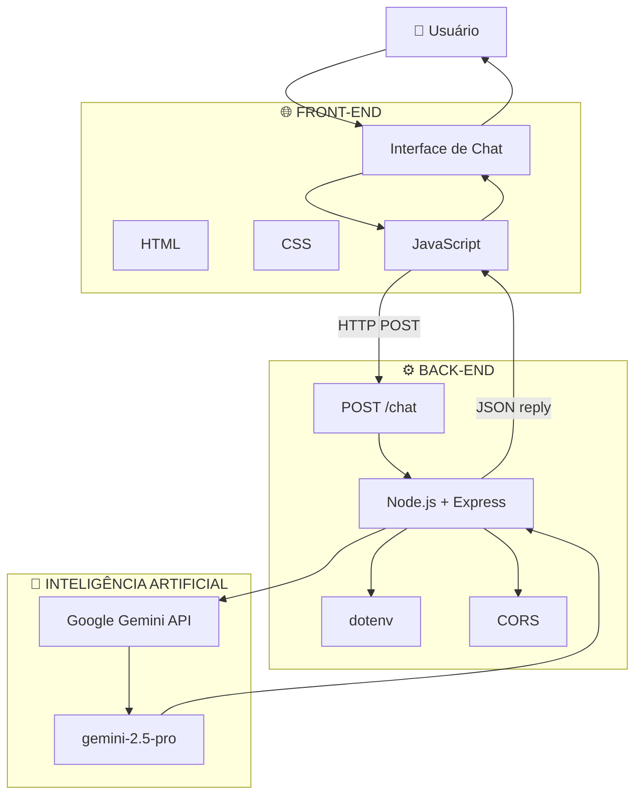
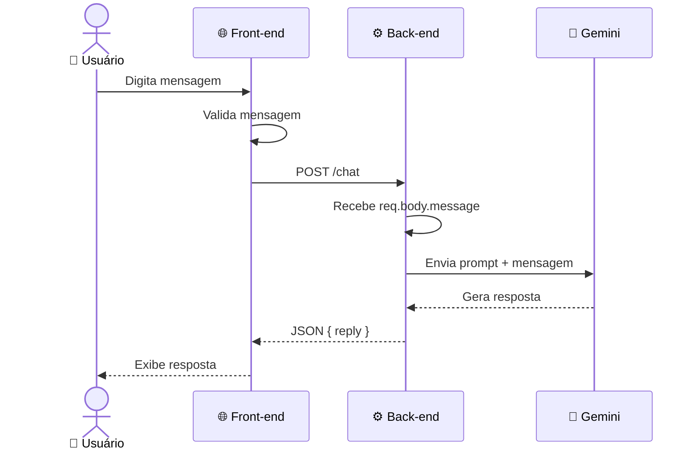

<div align="center">

# 💚 AMPARA

### Plataforma digital de apoio emocional com Inteligência Artificial

**Acolhimento • Informação • Tecnologia • Empatia**

<br>


<br><br>

[](https://github.com/MiqueiasNves/ampara-1)

</div>

---

## 📌 Sobre o projeto

**Ampara** é uma plataforma web desenvolvida com o objetivo de oferecer um espaço digital de **informação, acolhimento e apoio emocional**.

A aplicação combina uma interface web com um back-end em **Node.js + Express** e integração com a **Google Gemini API**, permitindo que o usuário converse com a Ampara por meio de uma interface de chat.

Além da conversa com a IA, a plataforma disponibiliza conteúdos relacionados à saúde mental, incluindo temas como:

* 🧠 Saúde mental
* 😰 Ansiedade
* 💭 Depressão
* 🔥 Burnout
* ⚡ Estresse
* ❤️ Autoestima
* 😴 Sono
* 🌱 Reeducação mental
* 🤝 Apoio

> **Objetivo:** utilizar a tecnologia como ferramenta de acolhimento e acesso à informação, sem substituir profissionais especializados.

---

# 🎯 Objetivos

O projeto foi pensado para:

* Facilitar o acesso a informações relacionadas à saúde mental;
* Criar um espaço digital de acolhimento;
* Utilizar Inteligência Artificial para estabelecer conversas empáticas;
* Incentivar práticas de autocuidado;
* Direcionar usuários para ajuda profissional quando necessário;
* Desenvolver uma aplicação web utilizando arquitetura separada entre front-end e back-end.

---

# ✨ Funcionalidades

## 🤖 Conversa com a Ampara

A principal funcionalidade do projeto é o chat com a Ampara.

O usuário envia uma mensagem através da interface web e o front-end realiza uma requisição para o back-end através da rota:

```http
POST /chat
```

O servidor recebe a mensagem, constrói o contexto da IA e envia a solicitação para o modelo Gemini.

A resposta retorna ao front-end e é apresentada ao usuário.

### Fluxo

```text
Usuário
   │
   ▼
Interface de Chat
   │
   │ POST /chat
   ▼
Node.js + Express
   │
   ▼
Google Gemini API
   │
   ▼
Resposta da Ampara
   │
   ▼
Interface de Chat
   │
   ▼
Usuário
```

A integração está implementada no `server.js`, utilizando `GoogleGenerativeAI` e o modelo `gemini-2.5-pro`.

---

## 📚 Conteúdos sobre saúde mental

A plataforma disponibiliza páginas e conteúdos relacionados a diferentes temas de saúde mental.

Entre eles estão:

| Tema                 | Objetivo                                          |
| -------------------- | ------------------------------------------------- |
| 🧠 Saúde Mental      | Apresentar informações introdutórias sobre o tema |
| 😰 Ansiedade         | Informações e orientações gerais                  |
| 💭 Depressão         | Conteúdo educativo                                |
| 🔥 Burnout           | Informações sobre esgotamento                     |
| ⚡ Estresse           | Conteúdo relacionado ao gerenciamento do estresse |
| ❤️ Autoestima        | Incentivo ao autocuidado e autoconhecimento       |
| 😴 Sono              | Informações sobre hábitos relacionados ao sono    |
| 🌱 Reeducação Mental | Conteúdos voltados a hábitos e mudanças positivas |
| 🤝 Apoio             | Direcionamento para recursos de apoio             |

---

# 🧠 Caso de uso

## UC-01 — Conversar com a Ampara

**Ator:** Usuário

**Objetivo:** permitir que o usuário envie uma mensagem e receba uma resposta da Ampara.

### Pré-condições

* A aplicação deve estar disponível;
* O servidor Node.js deve estar em execução;
* A variável `GEMINI_API_KEY` deve estar configurada;
* O usuário deve estar na interface de conversa.

### Fluxo principal

1. O usuário acessa a plataforma;
2. Seleciona a opção de conversa;
3. O sistema apresenta a interface de chat;
4. O usuário digita uma mensagem;
5. O usuário envia a mensagem;
6. O front-end envia uma requisição `POST /chat`;
7. O back-end recebe a mensagem;
8. O servidor cria o prompt da Ampara;
9. O prompt é enviado ao Google Gemini;
10. O Gemini gera a resposta;
11. O back-end retorna a resposta em JSON;
12. O front-end apresenta a resposta ao usuário.

### Fluxo alternativo — mensagem vazia

```text
Usuário
   │
   ▼
Envia mensagem vazia
   │
   ▼
Sistema valida entrada
   │
   ▼
Mensagem rejeitada
```

### Fluxo alternativo — erro no servidor

```text
Usuário
   │
   ▼
Envia mensagem
   │
   ▼
Falha na comunicação
   │
   ▼
Sistema apresenta mensagem de erro
```

O front-end possui tratamento para erros de comunicação, enquanto o back-end retorna HTTP `500` quando ocorre uma falha durante a geração da resposta.

---

# 👥 Atores do sistema



### Usuário

Interage diretamente com a plataforma, consulta os conteúdos e utiliza o chat.

### Ampara

É a interface de inteligência artificial responsável pela conversa e pelo acolhimento inicial.

### Google Gemini

Serviço externo utilizado pelo back-end para processamento das mensagens e geração das respostas.

---

# 🏗️ Arquitetura

O projeto possui uma separação entre:

```text
ampara-1/
│
├── backend/
│   └── server.js
│
├── frontend/
│   ├── index.html
│   ├── css/
│   ├── js/
│   │   └── chatbot.js
│   └── ...
│
├── .gitignore
└── README.md
```

A estrutura atual do repositório apresenta os diretórios `backend` e `frontend`.

---

## 🔧 Arquitetura da aplicação



O back-end utiliza Express, CORS, dotenv e `@google/generative-ai`, além de servir os arquivos estáticos do front-end.

---

# 🔄 Fluxo da comunicação



---

# 🧩 Tecnologias utilizadas

## Front-end

<div>


</div>

Responsável pela interface, navegação, apresentação dos conteúdos e interação com o chatbot.

---

## Back-end

<div>


</div>

Responsável pelo servidor, processamento das requisições e comunicação com a API de inteligência artificial.

---

## Inteligência Artificial

<div>


</div>

O projeto utiliza a biblioteca `@google/generative-ai` para realizar a integração com o Gemini. O servidor atualmente configura o modelo `gemini-2.5-pro`.

---

# 🔐 Configuração da API

A chave da API não deve ser armazenada diretamente no código.

O projeto utiliza uma variável de ambiente:

```env
GEMINI_API_KEY=sua_chave_aqui
```

O `dotenv` é utilizado para carregar as variáveis de ambiente.

> ⚠️ **Nunca publique sua `GEMINI_API_KEY` no GitHub.**

---

# 🚀 Instalação e execução

## 1. Clone o projeto

```bash
git clone https://github.com/MiqueiasNves/ampara-1.git
```

Entre na pasta:

```bash
cd ampara-1
```

---

## 2. Entre no back-end

```bash
cd backend
```

---

## 3. Instale as dependências

```bash
npm install
```

---

## 4. Configure as variáveis de ambiente

Crie um arquivo:

```text
.env
```

Dentro dele:

```env
GEMINI_API_KEY=sua_chave_da_api
PORT=3000
```

---

## 5. Inicie o servidor

```bash
node server.js
```

O servidor utiliza a porta definida pela variável `PORT` ou, caso ela não exista, a porta `3000`.

---

## 6. Acesse a aplicação

Abra no navegador:

```text
http://localhost:3000
```

O próprio servidor possui uma rota inicial para verificar se a aplicação está funcionando:

```text
Servidor da Ampara funcionando 💚
```

---

# 📸 Screenshots

> **Adicione aqui as capturas reais da aplicação.**

Sugestão de organização:

```text
frontend/
└── images/
    ├── home.png
    ├── chat.png
    ├── ansiedade.png
    ├── apoio.png
    └── reeducacao.png
```

Depois, substitua esta seção por:

### 🏠 Página inicial

<p align="center">
  
</p>

### 🤖 Conversa com a Ampara

<p align="center">
  
</p>

### 🧠 Conteúdos

<p align="center">
  
</p>

### 🤝 Área de apoio

<p align="center">
  
</p>

---

# 📁 Estrutura do projeto

```text
ampara-1/
│
├── backend/
│   ├── package.json
│   ├── package-lock.json
│   └── server.js
│
├── frontend/
│   ├── index.html
│   │
│   ├── css/
│   │   └── ...
│   │
│   ├── js/
│   │   ├── chatbot.js
│   │   └── ...
│   │
│   ├── images/
│   │   └── ...
│   │
│   └── pages/
│       └── ...
│
├── .gitignore
└── README.md
```

> A estrutura acima representa a organização principal do projeto. Arquivos adicionais podem ser adicionados conforme a evolução da aplicação.

---

# 🛡️ Diretrizes da Ampara

A personalidade da IA é definida no back-end com algumas diretrizes importantes:

```text
✓ Acolher emocionalmente
✓ Conversar com empatia
✓ Incentivar o autocuidado
✓ Evitar julgamentos
✓ Manter comunicação gentil
✓ Manter comunicação calma
✓ Ser objetiva

✕ Não substituir psicólogos
✕ Não realizar diagnóstico
✕ Não substituir atendimento profissional
```

O prompt implementado no servidor orienta explicitamente a Ampara a não substituir psicólogos e a recomendar ajuda profissional em situações graves.

---

# ⚠️ Aviso importante

A **Ampara não substitui psicólogos, psiquiatras, médicos ou qualquer profissional de saúde**.

A aplicação possui finalidade **educativa e de acolhimento inicial**.

As respostas produzidas por inteligência artificial podem conter erros e não devem ser utilizadas como diagnóstico ou tratamento médico.

Em situações de emergência ou risco, procure imediatamente os serviços profissionais e de emergência disponíveis na sua região.

---

# 🔮 Próximos passos

O projeto encontra-se em evolução e possui espaço para diversas melhorias.

### Interface

* [ ] Melhorar responsividade
* [ ] Aprimorar acessibilidade
* [ ] Criar modo escuro
* [ ] Melhorar experiência do chat
* [ ] Adicionar animações e microinterações

### Inteligência Artificial

* [ ] Implementar histórico de conversa
* [ ] Melhorar contexto das conversas
* [ ] Aprimorar tratamento de situações de risco
* [ ] Criar diferentes contextos de atendimento
* [ ] Implementar controle de sessão

### Back-end

* [ ] Criar arquitetura de serviços
* [ ] Adicionar validação de dados
* [ ] Implementar logging estruturado
* [ ] Criar testes automatizados
* [ ] Adicionar documentação da API
* [ ] Implementar rate limiting

### Segurança

* [ ] Melhorar proteção da API
* [ ] Implementar gerenciamento seguro de credenciais
* [ ] Criar políticas de privacidade
* [ ] Avaliar armazenamento e tratamento de dados sensíveis

### Deploy

* [ ] Hospedar front-end
* [ ] Hospedar back-end
* [ ] Configurar variáveis de ambiente em produção
* [ ] Configurar domínio
* [ ] Implementar CI/CD

---

# 🤝 Contribuição

Contribuições são bem-vindas.

Se você quiser contribuir:

### 1. Faça um Fork

```bash
git fork
```

ou utilize a opção **Fork** diretamente no GitHub.

### 2. Clone seu fork

```bash
git clone https://github.com/SEU-USUARIO/ampara-1.git
```

### 3. Crie uma branch

```bash
git checkout -b feature/nova-funcionalidade
```

### 4. Faça suas alterações

Desenvolva a funcionalidade ou correção.

### 5. Faça o commit

```bash
git add .
git commit -m "feat: adiciona nova funcionalidade"
```

### 6. Envie para o GitHub

```bash
git push origin feature/nova-funcionalidade
```

### 7. Abra um Pull Request

Explique:

* O que foi alterado;
* Qual problema foi resolvido;
* Como testar;
* Quais arquivos foram modificados.

---

# 🧑‍💻 Desenvolvedor

<div align="center">

### Miqueias Neves

Estudante de Análise e Desenvolvimento de Sistemas
Desenvolvedor em formação com foco em Back-End e tecnologias emergentes.

<br>

<a href="https://github.com/MiqueiasNves">


</a>

</div>

---

# 💚 Propósito

> **Tecnologia também pode ser uma forma de cuidar.**

A Ampara nasceu da ideia de utilizar tecnologia e Inteligência Artificial para criar uma experiência digital mais humana, acessível e acolhedora.

O projeto representa também uma oportunidade de aplicar conhecimentos de **desenvolvimento web, APIs, integração com Inteligência Artificial, arquitetura de software e experiência do usuário** em uma aplicação com propósito social.

---

<div align="center">

### 💚 AMPARA

**Acolher. Informar. Conectar.**

<br>


<br><br>

⭐ Se este projeto despertou seu interesse, considere deixar uma estrela no repositório!

</div>
